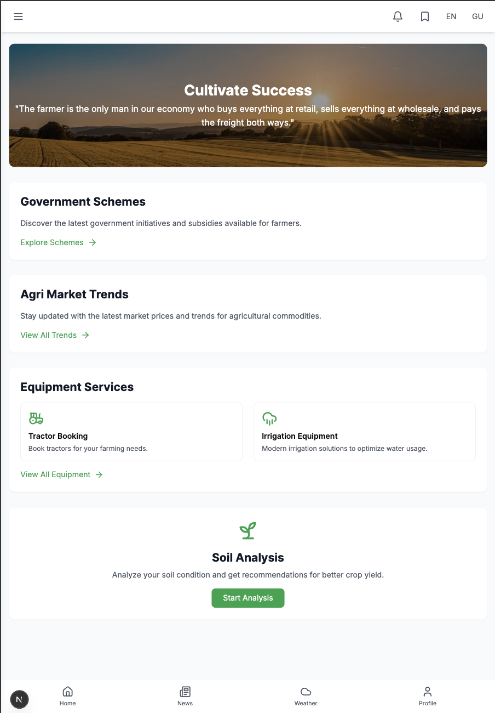
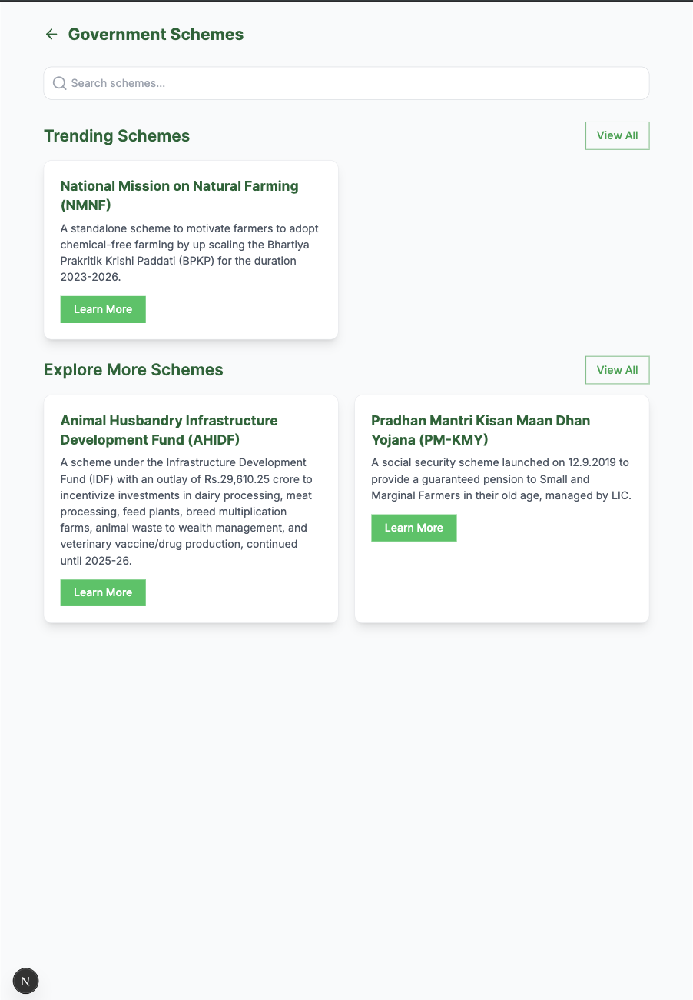
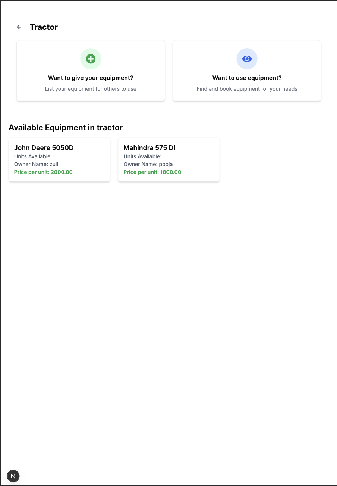

**Project Name** : AgriSutra  
**Team No** : 39  
**Team Name** : Fierces'  
**Team Leader** : Zuli Dobariya - 22AIML009

[📹 Watch Video : Drive Link]([https://drive.google.com/file/d/YOUR_VIDEO_ID/view](https://drive.google.com/drive/folders/1Kq7FHHe0k47sdOoSNX4BOsTMzxveMYUZ?usp=drive_link))

# 🌾 AgriSutra - Empowering Farmers with Technology

    
    
        

    
    

## 🚜 What is AgriSutra?
AgriSutra is a smart digital assistant for farmers. It helps them make better farming decisions using **Artificial Intelligence (AI) and Machine Learning (ML)**. The platform provides real-time insights on:

- 🌱 **Soil health & crop recommendations**
- 🌦 **Weather forecasts**
- 📈 **Market trends & commodity prices**
- 🏛 **Government schemes & subsidies**
- 🚜 **Farming equipment management**
- 📰 **Latest agricultural news**

With AgriSutra, farmers can access crucial information at their fingertips! 📲

---

## 📌 Why Did We Build AgriSutra?
Farmers face many challenges, such as:

- ❌ Lack of access to **real-time farming data** (60-70% of farmers struggle with this)
- ❌ Difficulty in understanding **government schemes & subsidies**
- ❌ Unpredictable **weather patterns** affecting crops
- ❌ Inefficient market access leading to **post-harvest losses** (up to 40%)

AgriSutra bridges this gap by providing **easy-to-use, AI-powered farming solutions** to **boost productivity and income**. 🚀

---

## 🌟 Key Features

### 🏆 Smart Farming Tools
✔ **Soil Analysis & Crop Suggestion** – Know what to plant based on soil quality.  
✔ **Weather Alerts** – Get forecasts to plan farming activities.  
✔ **Market Prices** – Track crop price trends to sell at the best rates.  
✔ **Government Schemes** – Find and apply for subsidies easily.  
✔ **Equipment Services** – Rent, share, or book farm equipment.  
✔ **Real-time News** – Stay updated on agriculture trends.  

---

## 🏛 Civic Tech for Farmers
We chose the **Civic Tech** category because AgriSutra solves real-life problems for farmers, particularly small-scale ones. 🌍 By providing essential farming insights, we **empower rural communities and promote sustainable agriculture**. 

### 📊 Quick Facts:
- 📡 **Digital advisory services** can **increase crop yield by 20-30%** 🌾
- 📉 Only **30-40% of eligible farmers** successfully access government subsidies
- 🚜 **Post-harvest losses** account for up to **40% of total produce**

AgriSutra helps farmers overcome these challenges with **simple and effective technology**. ✅

---

## 💻 Tech Stack

### 🖥 Frontend:
- ⚡ **Next.js** – Fast, scalable web apps
- 🛠 **TypeScript** – Ensures clean, bug-free code

### 🚀 Backend:
- 🌐 **Express.js (JavaScript)** – Manages API requests
- 🐍 **Flask (Python)** – Runs AI-powered insights

### 🗄 Database:
- 🗃 **PostgreSQL** – Stores structured farming data

### 🧠 Machine Learning:
- 🤖 **Python (ML models)** – Provides smart recommendations
- 🔥 **Flask API** – Serves AI insights to users

---

## 📢 Join the AgriSutra Revolution! 🚜
We believe **technology can transform farming** and make life easier for millions of farmers. **AgriSutra is built for them!** ❤️

